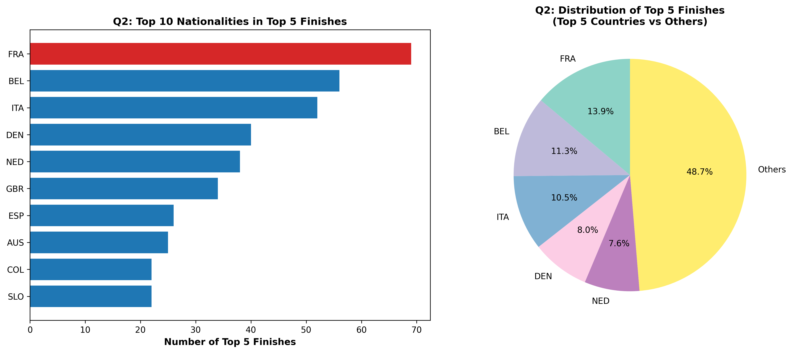

# Pro Cycling WorldTour Stage Analytics (2021–2025)

An end-to-end data extraction and sports analytics pipeline analyzing 995 stage finishes across three UCI WorldTour races — Tirreno–Adriatico, Paris–Nice, and Tour de Suisse. The project investigates international diversity trends, podium concentration, team roster composition, and host-nation advantage using only the Python standard library plus NumPy, Matplotlib, and BeautifulSoup.



---

## Executive Summary

* **Extraction integrity:** 995 stage finishes scraped across two different site architectures (Wikipedia HTML tables and FirstCycling's parameterized endpoints), with 0 missing values and validated 3-letter UCI country codes.
* **Roster diversity as a floor-raiser:** Team nationality diversity correlates strongly with the *volume* of top-10 finishes (r = 0.78), but shows negligible correlation with average finish rank (r = -0.09). Diverse rosters look like a strategy for consistent stage points across a roster, not for producing a single dominant rider.
* **Podium concentration:** While top-10 finishes represent broad international participation (12–18 unique nationalities per race per year), top-5 finishes are more concentrated in traditional cycling nations — France (13.9%) and Belgium (11.3%) alone account for a quarter of all top-5 finishes across the dataset.
* **Host-nation advantage:** Home riders take an average of ~23.8% of top-10 finishes in Tirreno–Adriatico (Italy) and ~22.4% in Paris–Nice (France), but only ~6.7% in the Tour de Suisse.

---

## Repository Structure

```text
Project_bike_races/
├── data/                                 # Cached datasets (scraped once, reused by the analysis notebook)
│   ├── tirreno_adriatico_2021_2025.csv   # 348 records
│   ├── paris_nice_2021_2025.csv          # 309 records
│   └── tour_de_suisse_2021_2025.csv      # 338 records
├── 1_webscraping_and_cleaning.ipynb      # OOP scrapers, rate-limiting, and name/nationality normalization
├── 2_analysis.ipynb                      # Five research questions, correlation analysis, and plotting
├── q1_nationality_diversity.png          # Generated visualizations
├── q2_top_nationalities.png
├── q3_team_diversity.png
├── q4_host_contribution.png
├── q5_diversity_performance.png
├── requirements.txt
└── README.md
```

---

## Data Pipeline

**Extraction (`1_webscraping_and_cleaning.ipynb`)**
- Modular OOP parsers (`WikiRaceParser`, `FirstCyclingParser`) that pull the top 10 finishers from stages 1–7 of each race/year.
- `cloudscraper` with custom browser headers to navigate each site's anti-bot protections, plus polite request delays (`time.sleep`) to avoid hammering either server.
- Rider names and 3-letter UCI nationality codes are normalized from each site's own format (ISO-style suffix on Wikipedia, CSS flag classes on FirstCycling) into a single consistent schema.
- Tour de Suisse scraping from FirstCycling is currently blocked (403), so that stage of the pipeline loads its previously-scraped, already-validated data from `data/tour_de_suisse_2021_2025.csv` instead of hitting the site live.

**Reproducibility**
- All cleaned data is committed under `data/`, so `2_analysis.ipynb` runs deterministically end-to-end without any network access or re-scraping.

---

## Key Analytical Findings

1. **Nationality diversity is stable, not trending.** Top-10 finishes span 12–18 unique nationalities per race per year across all three tours, with no consistent upward or downward trend from 2021–2025.
2. **Team roster diversity tracks quantity of success, not quality.** The most internationally diverse squads accumulate the most top-10 finishes overall, but roster diversity has almost no relationship with how high individual riders finish (r = -0.09 vs. average rank).
3. **Host-nation advantage is real but modest, and race-dependent.** Italian and French home riders take roughly a fifth to a quarter of top-10 spots in their home races; Swiss riders take a much smaller share (~6.7%) in the Tour de Suisse.

*(Full methodology, all five research questions, and discussion of limitations — including a note on inconsistent team-name formatting across seasons — are in `2_analysis.ipynb`.)*

---

## Setup & Execution

Clone the repository:
```bash
git clone https://github.com/v1qtor/bike-racing-web-scraping.git
cd bike-racing-web-scraping
```

Install dependencies:
```bash
pip install -r requirements.txt
```

Run the analysis:
Open and run `2_analysis.ipynb` in Jupyter. It loads directly from `data/` and regenerates all five figures — no network access required.

`1_webscraping_and_cleaning.ipynb` documents the original extraction pipeline; re-running it may fail if the source sites have since changed their markup or blocked automated access, since the cached CSVs in `data/` are what the analysis actually depends on.

---

## AI Assistance Disclosure

This project used AI coding assistants (GitHub Copilot / Claude) for scraping logic, regex-based data cleaning, and NumPy/Matplotlib plotting code. All research questions, analytical decisions, and conclusions were made independently. See the "Gen AI Citation" section at the end of `2_analysis.ipynb` for the full disclosure and a discussion of the dataset's limitations.
